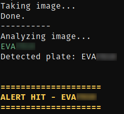

# Predator

A front end for OpenALPR designed to detect and record license plates in both pre-recorded and real-time video.

## Disclaimer

While Predator is reliable and resilient, you should not use it for safety critical tasks. Do not depend on Predator to autheticate cars at entry points, detect intruders, or monitor criminal activity.

## Description

[OpenALPR](https://github.com/openalpr/openalpr) is an open source utility designed to detect license plates, and return possible text from them. While it's a fantastic program, it's not exactly adept at managing large amounts of data on it's own. That's where Predator comes in.

Predator is a front-end for OpenALPR designed to run on Linux that takes large (or small) videos, and uses OpenALPR to scan for license plates efficiently. While high end systems with high resolution cameras would make for an ideal set up, Predator can comfortably run on consumer hardware. Predator can operate in two possible modes: pre-recorded mode and real-time mode. In pre-recorded mode, Predator takes pre-recorded video files and scans them for license plates based on user-entered criteria. Contrarily, real-time mode uses a camera to take and analyze frames in real-time. Real-time mode can record license plates detected and display alerts if a plate matches an entry in a customizable database.

## Features

### Lightweight

Predator is a command line utility that uses very little resources, allowing the majority of your processing power to remain available for OpenALPR.

### Offline

Predator works entirely offline, and never even connects to the internet at all.

### Free

Predator is completely free to use, and contains absolutely no ads or data mining of any kind.

### Open Source

Predator is free and open source from top to bottom, and is 'free software', meaning you can make changes and distribute them to others freely.

### Generic

By design, Predator doesn't require specialized hardware to run. While higher resolution cameras will obviously yield better results, and video format supported by FFMPEG will work with Predator.

### Easy

Predator is designed to be quick and easy to use. Just enter the root path of a project, enter a video name, and configure a few quick preferences, and Predator automatically starts processing videos, detecting plates, validating results, and forming a conveinent, easy to read list of license plates.

### Private

Since Predator is open source, self hosted, offline, and self contained, you can rest assured that it's completely private, and it doesn't collect any of the information you provide it.

### Multipurpose

Predator is deliberately designed to be multipurpose. It can operate both as an analysis tool for pre-recorded video, as well as a real-time monitoring program.

### Customizable

Predator is extremely customizable, making it easy to fit into any use case.

## Screenshots

### Real-time Mode Alert

When operating in real-time mode, Predator can display alerts when it detects a plate found in a configured database.

### Pre-recorded Mode Sample Image

While operating in pre-recorded mode, Predator can analyze any video, including dashcam video

### Pre-recorded Sample Analysis

After scanning through an entire pre-recorded video based on user-configured preferences, Predator can display and export all of the plates it detected.

