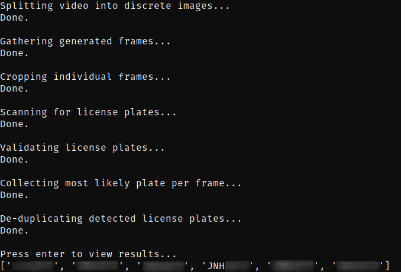

# Predator

A front end for OpenALPR designed to detect and record license plates in both pre-recorded and real-time video.

## Disclaimer

While Predator is reliable and resilient, you should not use it for safety critical tasks. Do not depend on Predator to autheticate cars at entry points, detect intruders, or monitor criminal activity unless you are fully prepared for it to fail.

## Description

Predator is a powerful camera and video processing tool designed to detect license plates in both real-time and in pre-recorded videos. Predator uses OpenALPR as it's back-end, and adds dozens of powerful features ontop of OpenALPR's already strong performance. Predator is designed to process large amounts of video efficiently on both high end hardware and affordable, low-power device, which makes it extremely versatile. It's designed to be highly customizable, allowing it to fit into any use case, ranging from a static video processing workstation, to a fully offline mobile real-time detection system.

## General Features

### Lightweight

Predator is a command line utility that uses very little resources, allowing the majority of your processing power to remain available for OpenALPR.

### Offline

Predator works entirely offline, and never needs to connect to the internet to function. Predator only ever makes network requests when the user actively asks it to download information from a network host.

### Free

Predator is completely free to use, and contains absolutely no ads or data mining of any kind.

### Open Source

Predator is free and open source from top to bottom, and is 'free software', meaning you can make changes and distribute them to others freely.

### Generic

By design, Predator doesn't require specialized hardware to run. While higher resolution cameras will obviously yield better results, and video format supported by FFMPEG will work with Predator.

### Easy

Predator is designed to be quick and easy to use. Just enter the root path of a project, enter a video name, and configure a few quick preferences, and Predator automatically starts processing videos, detecting plates, validating results, and forming a conveinent, easy to read list of license plates.

### Private

Since Predator is open source, self hosted, offline, and self contained, you can rest assured that it's completely private, and it doesn't collect any of the information you provide it.

### Multipurpose

Predator is deliberately designed to be multipurpose. It can operate both as an analysis tool for pre-recorded video, as well as a real-time monitoring program.

### Customizable

Predator is extremely customizable, making it easy to fit into any use case.

### Mobile

Predator is designed to support low-energy-usage hardware so that it can be easily installed in a vehicle.

### Location Aware

Predator supports GPX files to allow for correlating license plates detected in pre-recorded video to their physical coordinates.

### Alerts

Predator supports real-time alerts, allowing the user to be notified when a license plate matching one on a list is detected. This can be used to detect employee vehicles, spot vehicles involved in AMBER alerts, etc.

### Safe

Predator comes with several features that improve safety in vehicle-based installation. Predator supports displaying large recognizable shapes to tell the driver of important events at a glance. Predator even supports recognizable audible alerts, eliminating the need to look away from the road all-together.

### Dash-cam

Predator comes with a dash-cam mode, allowing for customizable real-time recording without processing license plates. Dash-cam videos can later be processed by Predator in pre-recorded mode.

### Headless Ready

While Predator comes with a straight forward interface, it can be fully configured to run in headless mode, without any user interaction necessary. This makes it perfect for vehicle installations, where the driver wants Predator to automatically start when the vehicle turns on without any user input.

### Push Notifications

Predator is capable of using a Gotify server to send push notifications for certain events. This ensures that you'll always be up to date when license plates are detected, even if your specific Predator set-up doesn't have a display or audio system connected.

## Screenshots

### Real-time Mode Alert

When operating in real-time mode, Predator can display alerts when it detects a plate found in a configured database.

### Pre-recorded Mode Sample Image

While operating in pre-recorded mode, Predator can analyze any video, including dashcam video

### Pre-recorded Sample Analysis

After scanning through an entire pre-recorded video based on user-configured preferences, Predator can display and export all of the plates it detected.

